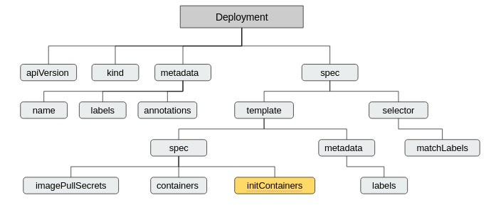
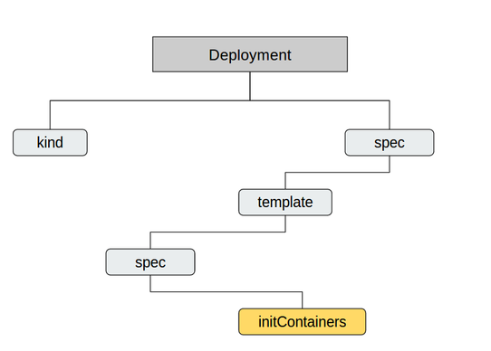
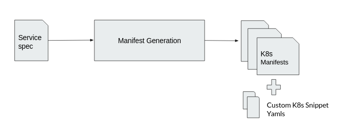

# Custom K8s Snippets in Hyscale
#### Description

Hyscale generates K8s manifest yamls with respect to Hspec that satisfies the majority of application use cases with exception to few kubernetes concepts.The thought behind Custom K8s Snippets is to eliminate the effect of current/temporary limitations of Hyscale over user’s K8s requirements and approach regarding application use cases.

Allowing the end user to attach their own k8s yaml snippets to the Hspec provides a choice to customize or override on top of generated manifests by Hyscale. Also ensuring that the usage of Hspec and deploy using Hyscale should not restrict an end user from utilizing any K8s Features which are yet to be abstracted by Hyscale.

### Introducing 'k8sSnippets'

We have introduced a new field "k8sSnippets" in Hspec where in the user will provide paths for List of k8s snippets that needs to be patched on the generated manifest files. Refer k8sSnippets in [hyscale spec reference](https://github.com/hyscale/hspec/blob/master/docs/hyscale-spec-reference.md#k8ssnippets).

A simple hspec with custom k8s snippets looks like :

```yaml
name: myservice
image:
    registry: registry.hub.docker.com
    name: library/tomcat
    tag: 8.5.0-jre8
    
replicas: 2
external: true
ports:
  - port: 8080/tcp
       
k8sSnippets:
  - ./snippets/init-container-snippet.yaml
```
A sample hprof looks like:

```yaml
environment: stage
overrides: myservice
replicas:
    min: 1
    max: 4
    cpuThreshold: 30%
k8sSnippets:
  - ./snippets/init-container-snippet.yaml
```
### Writing a Custom K8s Snippet file

To understand how a custom k8s snippet file looks like, lets take an example where a user wants to add init container support for their deployment.

Here is a tree structure for the corresponding sample deployment yaml with init container support:




To obtain a custom k8s snippet for init-containers out of this, the user doesn't need to provide this entire stretch of k8s deployment yaml. 

They can just provide the kind and snippet that contains init-container information in a valid yaml file.


Example Snippet:
```yaml
kind: Deployment
spec:
  template:
      spec:
      initContainers:
      - name: init-myservice
          image: busybox:1.28
          command:
          - "/bin/sleep"
          - "60"
```
### Work Flow and Output
Based on the Kind, the following k8s snippet is patched onto the respective generated manifest file. In the above case as the kind is 'Deployment', the snippet is patched onto deployment manifest which is generated by hyscale manifest generator.



Here is a sample output of k8s deployment manifest which is generated post applying init-container custom k8s snippet:
```yaml
apiVersion: "apps/v1"
kind: "Deployment"
metadata:
  labels:
    hyscale.io/service-name: "myservice"
    hyscale.io/environment-name: "stage"
    hyscale.io/app-name: "app"
  name: "myservice"
spec:
   template:
     spec:
        imagePullSecrets:
        - name: "registry-hub-docker-com"
        containers:
        - name: "myservice"
           image: "registry.hub.docker.com/library/tomcat:8.5.0-jre8"
           imagePullPolicy: "Always"
           ports:
           - containerPort: 8080
              name: "8080-tcp"
              protocol: "TCP"
              resources: {}   
         initContainers:
         - name: "init-myservice"
            image: "busybox:1.28”
```
